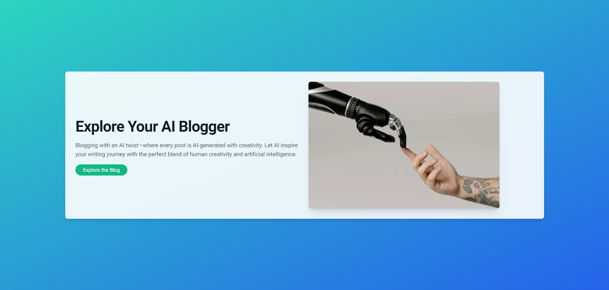
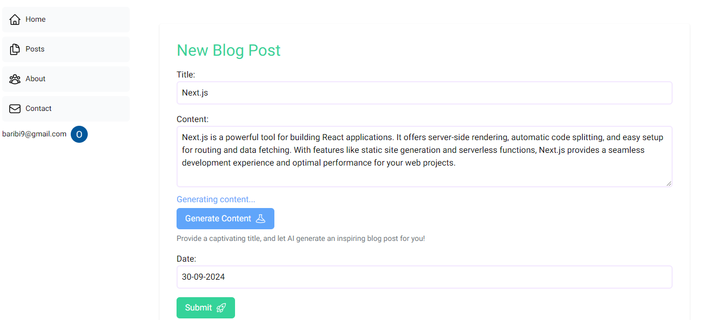
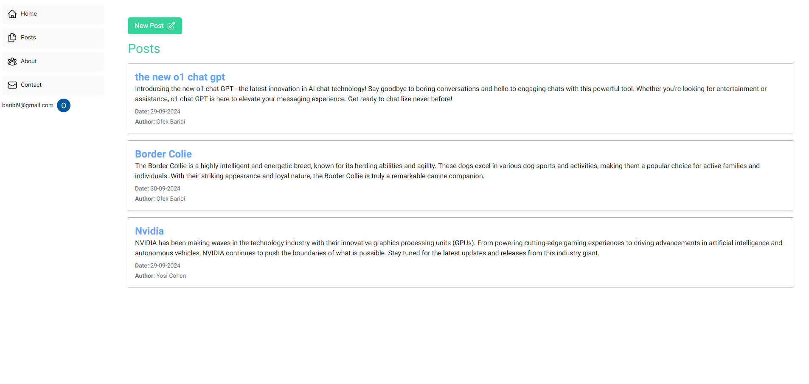
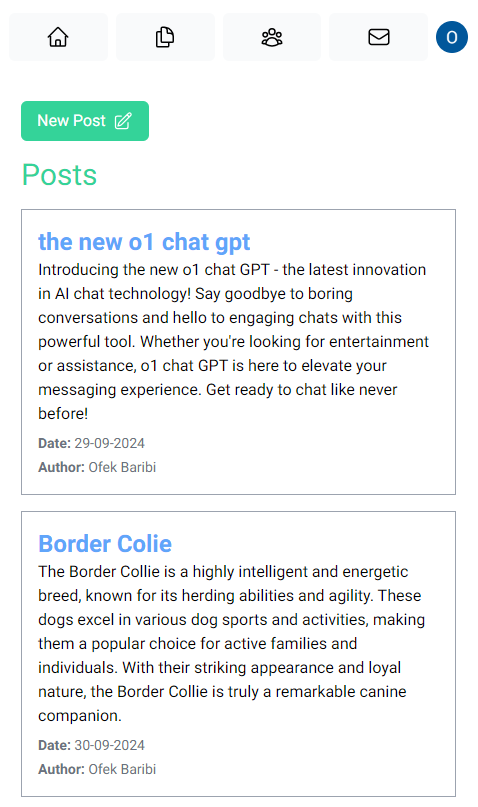

# AI Blogging Platform

This project is an **AI-driven blogging platform** created to learn and explore **Next.js** and the capabilities of **Server-Side Rendering (SSR)**. The platform allows users to generate AI-assisted blog posts, manage authentication, and interact with a seamless user experience using advanced **Next.js** features like file-based routing, API routes, dynamic and static rendering, caching, and more.

## Screenshots

  

  

## Features

- **Server-Side Rendering (SSR)**: Leveraged SSR for dynamic content fetching and SEO optimization.
- **Static and Dynamic Rendering**: Used static rendering for better performance and dynamic rendering for user-specific content.
- **Next.js File System Routing**: Followed file-based routing and API routes for organized project structure.
- **Tailwind CSS**: Styled the platform using Tailwind for responsive and modern UI components.
- **PostgreSQL Database with SQL**: Integrated PostgreSQL as the database, allowing easy content management.
- **Caching**: Applied efficient caching strategies using Next.js features like `unstable_noStore`.
- **Skeleton Loading**: Improved UX with loading skeletons for seamless transitions between pages.
- **Not Found Pages (404)**: Custom 404 page for better error handling.
- **Google Authentication**: User authentication and authorization using Google with **NextAuth.js**.
- **OpenAI Integration**: Built a chatbot that generates content using **OpenAI's GPT-3 API**, allowing users to generate AI-assisted blog posts.
- **Deployment**: Deployed on **Vercel** for continuous deployment and ease of scaling.

## Technologies Used

- **Next.js**: Framework for React with built-in SSR, SSG, and file-based routing.
- **React.js**: Front-end JavaScript library for building interactive UIs.
- **Tailwind CSS**: Utility-first CSS framework for building responsive and custom designs.
- **PostgreSQL**: Open-source relational database used for storing posts and user information.
- **Vercel**: Platform for frontend hosting and continuous deployment.
- **NextAuth.js**: Authentication for Next.js, with Google OAuth integration.
- **OpenAI API**: AI content generation using OpenAI’s GPT-3.
- **SQL**: Structured Query Language for interacting with PostgreSQL database.
- **ESLint**: For static code analysis and linting.

## Database Setup

This project uses **PostgreSQL** for storing user information and blog posts. Ensure that PostgreSQL is running and accessible by the app.

- Use the provided SQL schema or adjust it according to your needs to set up your tables for posts and user data.

## Authentication Setup

- **Google Authentication** is used for login. To configure:
  - Set up a new project on [Google Cloud Console](https://console.cloud.google.com/).
  - Enable **OAuth** and generate `GOOGLE_CLIENT_ID` and `GOOGLE_CLIENT_SECRET`.
  - Add the credentials to the `.env` file.
  
  NextAuth.js handles the integration with Google OAuth for easy sign-in.

## Deployment

The project is deployed on **Vercel**, which offers seamless integration with Next.js for hosting and CI/CD. Follow the steps below to deploy:

1. Push your code to a repository (GitHub, GitLab, etc.).
2. Connect your repository to **Vercel**.
3. Set the required environment variables on Vercel (DATABASE_URL, NEXTAUTH_URL, etc.).
4. Deploy the app.

Vercel will automatically build and deploy your Next.js project.
